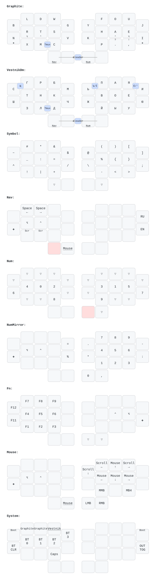

# keebs

<details>
<summary>Layout preview</summary>



</details>

Personal ZMK + QMK configs: one shared keymap (Graphite layout, Vestnik Cyrillic, adaptive swaps, magic key, home row mods) generated across ~20 boards.

## Structure

```
config/                  ZMK: base.keymap + shared layers/behaviors/combos, per-board keymaps/shields
keymap/                  shared layout model: model.json, profiles.json, adaptive_swaps.toml
qmk/                     QMK keyboards + shared generator (qmk/scripts/generate_keymap.py)
draw/                    keymap-drawer config + generated previews (svg/yaml gitignored except cradio/luna)
scripts/                 generate, generate_adaptive_swaps.py, keymap.py (validate/manifest), render_qmk_draw.py
build.sh / qmk-build.sh  ZMK / QMK build entry points
Makefile                 shortcuts around the above
```

Board list: see `BOARD_TARGETS` in `Makefile`, or `make help`.

## Commands

```
make help                 list all targets
make setup                init all board workspaces
make <board>              build firmware + drawing, e.g. make cradio / make klor
make <board>-wired        QMK build only (dual-firmware boards)
make <board>-wireless     ZMK build only
make <board>-left/-right  build one half
make <board>-reset        settings_reset firmware
make draw                 regenerate all layout previews
make clean                remove build outputs + draw cache

python3 scripts/keymap.py validate --repo .   # cross-check model.json + profiles.json
./scripts/generate check                      # validate without building firmware
```

## Editing

- Layers: `config/includes/layers/*.dtsi`
- Combos: `config/includes/combos.dtsi`
- Feature flags / adaptive-swap opt-ins: `config/includes/features.dtsi`
- Adaptive swaps: `keymap/adaptive_swaps.toml`, generated into `config/includes/generated/` (gitignored, don't hand-edit)

QMK generation is strict: an unmapped ZMK behavior fails generation instead of emitting stale QMK output. Add new behavior mappings in `qmk/scripts/generate_keymap.py`.

Don't hand-edit `.cache/`, `.qmk/`, or `config/includes/generated/` — all regenerated on build.
