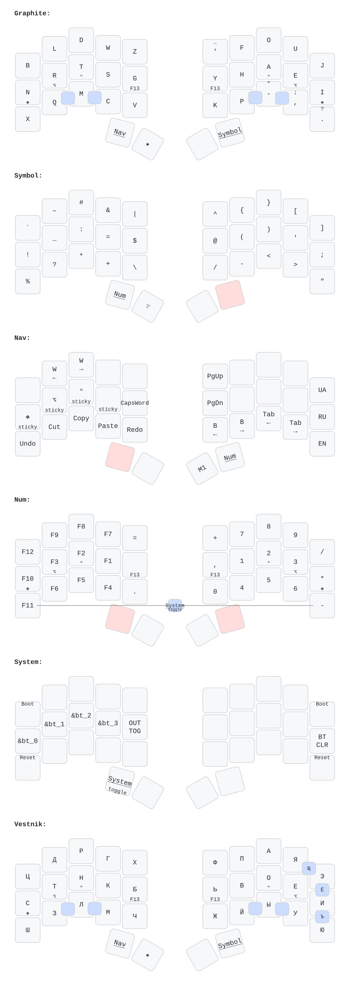

# keebs

Split keyboard firmware based on [Graphite](https://github.com/rdavison/graphite-layout) with [Vestnik](https://github.com/nxtk/vestnik-layout) for Cyrillic. Shared base config across multiple boards.

## Boards

| Board                                                                                                                       | Controller          | ZMK Remote      | Config           |
| --------------------------------------------------------------------------------------------------------------------------- | ------------------- | --------------- | ---------------- |
| [MoErgo Glove80](https://www.moergo.com/collections/glove80-keyboards/products/glove80-split-ergonomic-keyboard-revision-2) | integrated nRF52840 | moergo-sc/zmk   | `glove80.keymap` |
| [Ferris Sweep](https://github.com/davidphilipbarr/Sweep)                                                                    | nice!nano v2        | zmkfirmware/zmk | `cradio.keymap`  |

## Repo Structure

```
config/
  base.keymap          # shared: behaviors, macros, combos (abstract key names)
  glove80.keymap       # Glove80 wrapper: 80-key matrix, RGB, Magic layer
  glove80.conf
  glove80.build.yaml
  glove80.west.yml     # moergo-sc/zmk fork
  cradio.keymap        # Sweep wrapper: 34-key matrix, System layer
  cradio.conf
  cradio.build.yaml
  cradio.west.yml      # zmkfirmware/zmk upstream
draw/                  # keymap-drawer config and generated SVGs
build.sh               # local build script
Makefile               # keymap-drawer pipeline
```

Board wrappers include `base.keymap` and add board-specific layers/behaviors. Key positions use abstract names (`LT0`, `LM3`, `RB4`, etc.) from [zmk-helpers key-labels](https://github.com/urob/zmk-helpers/blob/main/docs/key_labels.md).

## Layers

| #   | Layer        | Activation     | Description                  |
| --- | ------------ | -------------- | ---------------------------- |
| 0   | Graphite     | default        | English alphas               |
| 1   | Vestnik      | lang macro     | Russian/Ukrainian alphas     |
| 2   | Symbol       | hold R thumb   | Full symbol set              |
| 3   | Nav          | hold L thumb   | L=editing, R=navigation      |
| 4   | Num          | from Sym/Nav   | L=F-keys, R=numpad           |
| 5   | Magic/System | board-specific | System/BT (+ RGB on Glove80) |

Magic layer access:

- **Glove80**: hold corner keys (positions 64/79)
- **Sweep**: from Num layer, combo both outer bottom pinkies (LB4+RB4) → toggle-locks System layer; left thumb exits

## Home Row Mods

[urob's "timeless" pattern](https://github.com/urob/zmk-config#timeless-homerow-mods) — GACS order on all layers:

```
pinky=GUI  ring=ALT  mid=CTL  index=SFT  inner=F13
```

Three anti-misfire mechanisms:

- **Balanced flavor** — hold resolves on next key press+release (not just press)
- **Idle cooldown** (`require-prior-idle-ms = <150>`) — fast typing always taps
- **Bilateral filter** (`hold-trigger-key-positions`) — hold only triggers from opposite hand (opt-in)

Opt-in via `#define BILATERAL`. When disabled, balanced flavor + idle cooldown still prevent most misfires.

## Adaptive Key (★)

Uses [urob/zmk-adaptive-key](https://github.com/urob/zmk-adaptive-key). Left inner thumb — tap for ★, hold for shift. Changes output based on the previously pressed key (within 300ms). Default: key repeat.

Thumb placement means zero same-finger conflicts with any key. Macro output chains into the next ★ press: `adj★m★` → "adjustment".

### Mappings

**SFB fixes:**

| Trigger | Output | SFB       |
| ------- | ------ | --------- |
| R★      | L      | rl 0.114% |
| G★      | S      | gs 0.102% |
| U★      | E      | ue 0.090% |
| E★      | U      | eu        |
| S★      | C      | sc 0.087% |
| H★      | Y      | hy 0.051% |
| P★      | H      | ph        |
| O★      | A      | oa 0.042% |
| W★      | S      | ws 0.042% |
| Y★      | H      | yh        |

**Suffix completions:**

| Trigger | Result | Example               |
| ------- | ------ | --------------------- |
| A★      | ation  | nation, education     |
| B★      | ble    | possible, table       |
| C★      | ction  | action, function      |
| D★      | dition | addition, condition   |
| F★      | fy     | modify, satisfy       |
| I★      | ion    | opinion, session      |
| J★      | just   | adjust, just          |
| L★      | lation | relation, translation |
| M★      | ment   | moment, element       |
| N★      | nion   | union, opinion        |
| Q★      | quen   | frequency, sequence   |
| T★      | tment  | treatment, apartment  |
| V★      | ver    | never, every, over    |
| Z★      | zation | organization          |
| SPC★    | the    | most common word      |
| .★      | ./     | terminal paths        |

**Programming:**

| Trigger | Result                                    |
| ------- | ----------------------------------------- |
| /★      | `/* \| */` (block comment, cursor inside) |
| #★      | `#include `                               |

### Cyrillic (Vestnik)

Separate `adaptive_key_ru` behavior on the Vestnik layer.

| Trigger | Output | SFB          |
| ------- | ------ | ------------ |
| Р★      | Н      | рн 0.155%    |
| Н★      | Р      | нр (reverse) |
| З★      | Д      | зд 0.115%    |
| Ч★      | К      | чк 0.072%    |
| Л★      | Н      | лн 0.054%    |

## Combos

Alpha layers only, 75ms timeout:

| Keys    | Output   |
| ------- | -------- |
| LB3+LB2 | ESC      |
| LB2+LB1 | TAB      |
| RB1+RB2 | ENTER    |
| RB2+RB3 | BSPC/DEL |

Cyrillic (Vestnik only): RT3+RT4 → Щ, RT4+RM4 → Ё, RM4+RB4 → Ъ

## Mod-Morphs

Base layer punctuation with shift variants:

| Tap | Shift |
| --- | ----- |
| `'` | `_`   |
| `-` | `"`   |
| `,` | `;`   |
| `.` | `?`   |

## Sticky Modifiers

Nav layer left home row: `sk GUI`, `sk ALT`, `sk CTL`, `sk SFT`, `CapsWord`.

Tap one or more sticky mods, release nav, press any key. Mods stack thanks to `ignore-modifiers` on `&sk`. Example: `sk CTL → sk SFT → key` = Ctrl+Shift+key.

## CapsWord

Nav layer left inner home (LM0). Tap for CapsWord, Shift+tap for CapsLock. Continues through: underscore, minus, backspace, delete, digits.

## Language Switching

Nav right pinky column: EN / RU / UA. Each macro switches to the corresponding layer and sends `Ctrl+Shift+Super+N` to the OS input method switcher.

## OS Abstraction

Set `OPERATING_SYSTEM` in the keymap: `1` = Linux (default), `2` = macOS, `3` = Windows. Affects modifier keys (Ctrl vs Cmd), Home/End behavior, and lock shortcut.

## Configuration

| Define             | Effect                        | Default     |
| ------------------ | ----------------------------- | ----------- |
| `BILATERAL`        | Positional hold-tap filtering | disabled    |
| `OPERATING_SYSTEM` | OS-specific key mappings      | `1` (Linux) |

## Building

### CI (GitHub Actions)

Separate workflows per board — push to GitHub builds automatically:

- `.github/workflows/build.yml` — Glove80 (moergo-sc/zmk)
- `.github/workflows/build-cradio.yml` — Sweep (zmkfirmware/zmk)

### Local

Prerequisites: `west`, `cmake`, `ninja`, and [Zephyr SDK](https://github.com/zephyrproject-rtos/sdk-ng/releases) (minimal + ARM toolchain + host tools) at `~/.local/zephyr-sdk-0.17.0`.

One-time workspace setup (west workspaces live at `~/.local/share/zmk-workspaces/<board>/`):

```bash
make setup                  # all boards
make glove80-setup          # Glove80 only
make cradio-setup           # Sweep only
```

Build firmware + drawings:

```bash
make                        # all boards: firmware + drawings
make glove80                # Glove80: firmware + drawing
make cradio                 # Sweep: firmware + drawing
make build                  # all firmware only
make draw                   # all drawings only
make glove80-draw           # Glove80 drawing only
CLEAN=1 make glove80-build  # full firmware rebuild
```

UF2 files are copied to `build/<board>/`. For finer control (single half, etc.):

```bash
./build.sh cradio left      # left hand only
./build.sh glove80 right    # right hand only
```

### Modules

- [urob/zmk-adaptive-key](https://github.com/urob/zmk-adaptive-key) — adaptive key behavior
- [urob/zmk-helpers](https://github.com/urob/zmk-helpers) — helper macros and key-labels

## Layout


