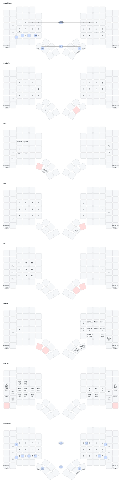

# ZMK Configuration

Split keyboard layout based on [Graphite](https://github.com/rdavison/graphite-layout) with [Vestnik](https://github.com/nxtk/vestnik-layout) for Cyrillic.

## Layers

| #   | Layer    | Activation   | Description              |
| --- | -------- | ------------ | ------------------------ |
| 0   | Graphite | default      | English alphas           |
| 1   | Vestnik  | lang macro   | Russian/Ukrainian alphas |
| 2   | Symbol   | hold R thumb | Full symbol set          |
| 3   | Nav      | hold L thumb | L=editing, R=navigation  |
| 4   | Num      | from Sym/Nav | L=F-keys, R=numpad       |
| 5   | Magic    | hold corner  | System/BT/RGB            |

Key positions (34-key core):

```
╭───────────────────╮ ╭───────────────────╮
│ 23  24  25  26  27│ │28  29  30  31  32 │
│ 35  36  37  38  39│ │40  41  42  43  44 │
│ 47  48  49  50  51│ │58  59  60  61  62 │
╰──────────╮ 69  70 │ │ 73  74 ╭──────────╯
           ╰────────╯ ╰────────╯
```

## Home Row Mods

[urob's "timeless" pattern](https://github.com/urob/zmk-config#timeless-homerow-mods) — GACS order on all layers:

```
pinky=GUI  ring=ALT  mid=CTL  index=SFT  inner=F13
```

Three anti-misfire mechanisms:

- **Balanced flavor** — hold resolves on next key press+release (not just press)
- **Idle cooldown** (`require-prior-idle-ms = <150>`) — fast typing always taps
- **Bilateral filter** (`hold-trigger-key-positions`) — hold only triggers from opposite hand

The same mod positions are used consistently: HRM on alpha/num, sticky mods on nav.

### Bilateral Hold-Tap

Opt-in via `#define BILATERAL`. When enabled, HRM only activates from opposite-hand keypresses. This eliminates same-hand misfire on fast rolls but **prevents same-hand mod chording**. Use nav layer sticky mods to stack modifiers instead.

When disabled, balanced flavor + idle cooldown still prevent most misfires.

## Adaptive Key (★)

Uses [urob/zmk-adaptive-key](https://github.com/urob/zmk-adaptive-key). Left inner thumb — tap for magic, hold for shift. Changes output based on the previously pressed key (within 300ms). Default output: `"`. Inspired by [joa/graphite](https://github.com/joa/graphite).

Thumb placement means zero same-finger conflicts with any key.

The module tracks HID keycodes, so macro output chains into the next ★ press: `adj★m★` → "adjustment", `m★i★` → "mention".

### Mappings

**SFB fixes** (from [cmini](https://github.com/grassfedreeve/cmini) frequency analysis):

| Trigger | Output | SFB |
|---------|--------|-----|
| R★ | L | rl 0.114% |
| G★ | S | gs 0.102% |
| U★ | E | ue 0.090% |
| E★ | U | eu |
| S★ | C | sc 0.087% |
| H★ | Y | hy 0.051% |
| P★ | H | ph |
| O★ | A | oa 0.042% |
| W★ | S | ws 0.042% |
| Y★ | H | yh |

**Suffix completions:**

| Trigger | Result | Example |
|---------|--------|---------|
| A★ | ation | nation, education |
| B★ | ble | possible, table |
| C★ | ction | action, function |
| D★ | dition | addition, condition |
| F★ | fy | modify, satisfy |
| I★ | ion | opinion, session |
| J★ | just | adjust, just |
| L★ | lation | relation, translation |
| M★ | ment | moment, element |
| N★ | nion | union, opinion |
| Q★ | quen | frequency, sequence |
| T★ | tment | treatment, apartment |
| V★ | ver | never, every, over |
| Z★ | zation | organization |
| SPC★ | the | most common word |
| .★ | ./ | terminal paths |

**Programming** (experimental — modified keycodes may not trigger):

| Trigger | Result |
|---------|--------|
| /★ | `/* \| */` (block comment, cursor inside) |
| #★ | `#include ` |

### Cyrillic (Vestnik)

Separate `adaptive_key_ru` behavior on the Vestnik layer. Triggers use QWERTY keycodes (the module tracks HID keycodes, OS input method converts to Cyrillic).

| Trigger | Output | SFB |
|---------|--------|-----|
| Р★ | Н | рн 0.155% |
| Н★ | Р | нр (reverse) |
| З★ | Д | зд 0.115% |
| Ч★ | К | чк 0.072% |
| Л★ | Н | лн 0.054% |

### Extending

Single key output:
```dts
ak_x { trigger-keys = <X>; max-prior-idle-ms = <300>; bindings = <&kp Z>; };
```

Multi-key output (define a macro, then reference it):
```dts
macro_tion: macro_tion {
    compatible = "zmk,behavior-macro";
    #binding-cells = <0>;
    bindings = <&kp T>, <&kp I>, <&kp O>, <&kp N>;
};
// in adaptive_key:
ak_a { trigger-keys = <A>; max-prior-idle-ms = <300>; bindings = <&macro_tion>; };
```

`max-prior-idle-ms = <300>` — trigger must have been pressed within 300ms.

## Sticky Modifiers

Nav layer left home row: `sk GUI`, `sk ALT`, `sk CTL`, `sk SFT`, `CapsWord`.

Tap one or more sticky mods, release nav, press any key. Mods stack thanks to `ignore-modifiers` on `&sk`. Example: `sk CTL → sk SFT → key` = Ctrl+Shift+key.

## Mod-Morphs

Base layer punctuation with shift variants:

| Tap | Shift |
| --- | ----- |
| `'` | `_`   |
| `-` | `"`   |
| `,` | `;`   |
| `.` | `?`   |

## Combos

Alpha layers only, 75ms timeout:

| Keys  | Output   |
| ----- | -------- |
| 48+49 | ESC      |
| 49+50 | TAB      |
| 59+60 | ENTER    |
| 60+61 | BSPC/DEL |

Cyrillic (Vestnik only): 31+32 → Щ, 32+44 → Ё/Ґ, 44+62 → Ъ/Ї

## CapsWord

Nav layer position 39 (left inner home). Tap for CapsWord, Shift+tap for CapsLock. Continues through: underscore, minus, backspace, delete, digits.

## Language Switching

Nav right pinky column: EN / RU / UA. Each macro switches to the corresponding layer and sends `Ctrl+Shift+Super+N` to the OS input method switcher.

## OS Abstraction

Set `OPERATING_SYSTEM` in the keymap: `1` = Linux (default), `2` = macOS, `3` = Windows. Affects modifier keys (Ctrl vs Cmd), Home/End behavior, and lock shortcut.

## Configuration

| Define             | Effect                        | Default     |
| ------------------ | ----------------------------- | ----------- |
| `BILATERAL`        | Positional hold-tap filtering | disabled    |
| `OPERATING_SYSTEM` | OS-specific key mappings      | `1` (Linux) |

## Building

Requires [urob/zmk-adaptive-key](https://github.com/urob/zmk-adaptive-key) module in `west.yml`. The module provides the adaptive key behavior through the ZMK build system (no `#include` needed).

Required Kconfig settings in `.conf`:
```
CONFIG_ZMK_ADAPTIVE_KEY_MAX_TRIGGER_CONDITIONS=64
CONFIG_ZMK_ADAPTIVE_KEY_MAX_BINDINGS=10
```

## Map visualization


