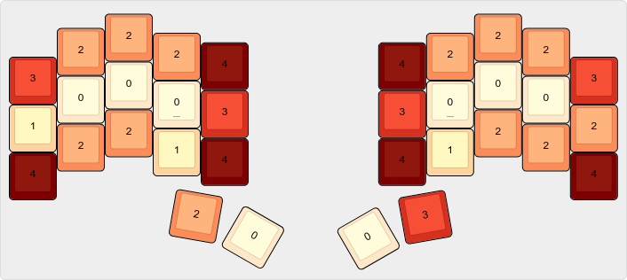

# keebs

Split keyboard firmware based on [Graphite](https://github.com/rdavison/graphite-layout) with [Vestnik](https://github.com/nxtk/vestnik-layout) for Cyrillic.

<details>
<summary>SVG visualization</summary>


</details>

## Boards

| Board | Config |
| ----- | ------ |
| [MoErgo Glove80](https://www.moergo.com/collections/glove80-keyboards/products/glove80-split-ergonomic-keyboard-revision-2) | `glove80.*` |
| [Ferris Sweep](https://github.com/davidphilipbarr/Sweep) | `cradio.*` |
| [Aurora Sweep](https://splitkb.com/products/aurora-sweep) | `splitkb_aurora_sweep.*` |

## Layers

All shared layers are defined once in `base.keymap` using a `ZMK_BASE_LAYER` macro from [urob/zmk-helpers](https://github.com/urob/zmk-helpers). Each board file either uses the default 34-key expansion or redefines the macro to inject the core layout into a larger matrix (see `glove80.keymap`).

| # | Layer | Activation | Description |
| - | ----- | ---------- | ----------- |
| 0 | Graphite | default | English alphas |
| 1 | Vestnik | lang macro | Russian/Ukrainian alphas |
| 2 | Symbol | hold R thumb | L=all symbols, R=brackets + sticky mods |
| 3 | Nav | hold L thumb | L=editing + sticky mods, R=navigation |
| 4 | Num | from Sym/Nav | L=F-keys, R=numpad |
| 5 | System | board-specific | BT/RGB/power |

## Home Row Mods

[urob's "timeless" mods](https://github.com/urob/zmk-config#timeless-homerow-mods) — GACS order: `pinky=GUI ring=ALT mid=CTL index=SFT`.

- **Balanced flavor** — hold resolves on next key press+release
- **Idle cooldown** (`require-prior-idle-ms = <150>`) — fast typing always taps
- **Bilateral filter** (opt-in via `#define BILATERAL`) — hold only triggers from opposite hand, which also makes it impossible to combine HRM from the same hand and would require using sticky mods combinations in order to do that.

## Adaptive Key (★)

[urob/zmk-adaptive-key](https://github.com/urob/zmk-adaptive-key) on left inner thumb (tap=★, hold=⇧). Changes output based on previous key. If the keyboard has been idle for a certain timing (300ms default) or the previously pressed key has no magic combo, the fallback is repeat_key.

<details>
<summary>SFB fixes</summary>

| Trigger | Output | SFB |
| ------- | ------ | --- |
| R★ | L | rl 0.114% |
| K★ | Y | ky |
| G★ | S | gs 0.102% |
| U★ | E | ue 0.090% |
| E★ | U | eu |
| S★ | C | sc 0.087% |
| H★ | Y | hy 0.051% |
| P★ | H | ph |
| O★ | A | oa 0.042% |
| W★ | S | ws 0.042% |
| Y★ | H | yh |

</details>

<details>
<summary>Suffix completions</summary>

| Trigger | Result | Example |
| ------- | ------ | ------- |
| A★ | ation | nation, education |
| C★ | ction | action, function |
| D★ | dition | addition, condition |
| I★ | ion | opinion, session |
| J★ | just | adjust, just |
| L★ | lation | relation, translation |
| M★ | ment | moment, element |
| N★ | nion | union, opinion |
| Q★ | quen | frequency, sequence |
| T★ | tment | treatment, apartment |
| Z★ | zation | organization |
| SPC★ | the | most common word |
| .★ | ./ | terminal paths |
| /★ | `/* \| */` | block comment |
| #★ | `#include ` | preprocessor |

</details>

<details>
<summary>Cyrillic (Vestnik)</summary>

Separate `adaptive_key_ru` on the Vestnik layer.

| Trigger | Output | SFB |
| ------- | ------ | --- |
| Р★ | Н | рн 0.155% |
| Н★ | Р | нр |
| З★ | Д | зд 0.115% |
| Ч★ | К | чк 0.072% |
| Л★ | Н | лн 0.054% |

</details>

## Symbol Layer

Left hand has all symbols optimized for programming bigrams, right hand has bracket rolls and sticky mods:

```
~    #    +    *    `        \    (    )    [    ]
!    =    /    _    $        @    ⇑°   ⌃°   ⌥°   ❖°
%    |    &    -    ^        ?    {    }    <    >
```

Placement follows key effort grades (from [T-34 layout blogpost](https://www.jonashietala.se/blog/2021/06/03/the-t-34-keyboard-layout)), where 0 is easiest and 4 is hardest:



- **Home row (effort 0)** for highest-frequency symbols: `=` `/` `_` `!`
- **Strong fingers for double-tap**: `==` (ring), `//` (mid), `&&` (mid), `||` (ring), `**` (index) — none on pinkies
- **Common bigrams as rolls**: `!=` inward, `+=` outward, `/*` outward, `*/` inward, `~=` inward
- **Cross-hand alternation** for `->` `=>` `<=` `>=`
- **4 bracket pairs as outward rolls**: `()` `{}` `[]` `<>` (also on base-layer combos)
- **Vim pairs**: `_`/`$` adjacent on home, `#`/`*` on top row, `^`/`%` on bottom

Sticky mods on right home row (index→pinky): `⇑° ⌃° ⌥° ❖°`. These stack with `ignore-modifiers` — tap multiple, release layer, press key.

## Configuration

| Define | Effect | Default |
| ------ | ------ | ------- |
| `BILATERAL` | Positional hold-tap filtering | disabled |
| `OPERATING_SYSTEM` | OS-specific keys (1=Linux, 2=macOS, 3=Windows) | `1` |

## Building

Push to GitHub builds automatically via per-board workflows. Local builds:

```bash
make setup                  # init west workspaces (one-time)
make                        # all boards: firmware + drawings
make glove80                # single board: firmware + drawing
make draw                   # drawings only
CLEAN=1 make glove80-build  # full firmware rebuild
./build.sh cradio left      # single half
```
