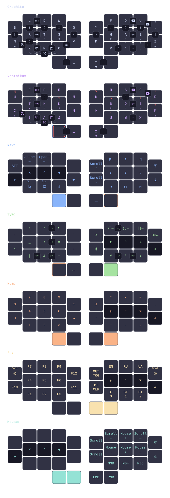
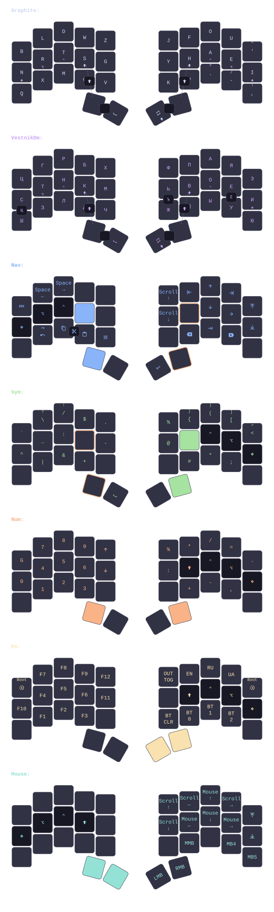

# keebs

Personal Graphite and Vestnik keymap compiled from one semantic model to ZMK, QMK, and keymap-drawer.

<details>
<summary>30-key layout</summary>



</details>

<details>
<summary>34-key layout</summary>



</details>

## Configuration

- `keymap/layers.toml`: keys and layers
- `keymap/behaviors.toml`: timings, combos, and behaviors
- `keymap/keymap.toml`: layer order and OS actions
- `keymap/profiles.json`: boards and physical layouts

```sh
just check
just draw
just targets
just build luna
just build aurora wired
```

`just` lists every command. Generated keymap sources live under `.cache/keymap/`; firmware builds live under `build/`; drawings live under `draw/generated/`.
